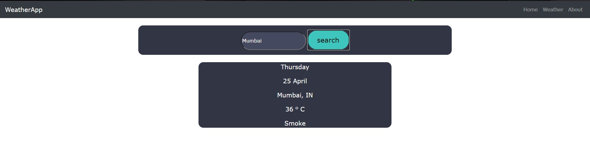
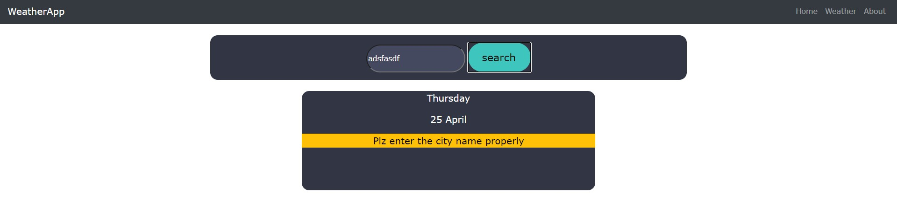
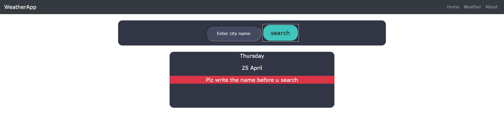

# weatherwebapp

## My First web app using Nodejs and express

## Nodewebapp

### This is web app using nodejs, express, api, html and css

## How to run this webapp?

### firstly install node and check in cmd by typing node -v

###  npm install (this will install require library's)

### npm run dev (as this project is written from the devloper mode)

